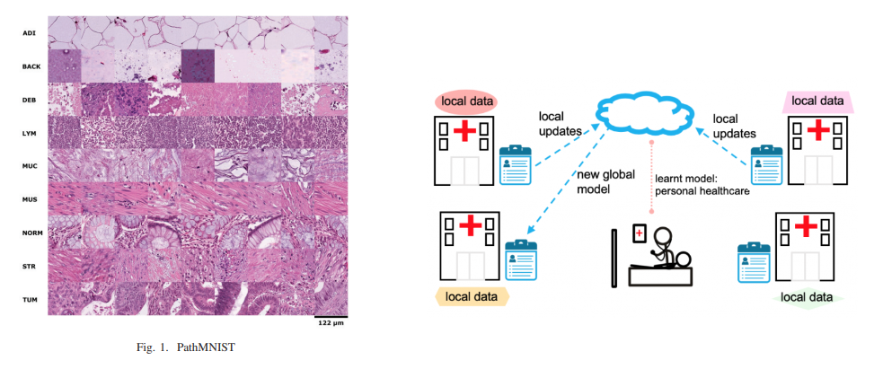

---

 ##### Links

+ [Paper](https://ieeexplore.ieee.org/document/9972224)
<!-- + [Online appendix](appendix1.pdf) -->
<!-- + [Code and data](https://github.com/pmichaillat/job-rationing) -->

---

##### Abstract

The availability of datasets pertaining to various
fields has increased significantly in the past decade, but there
still exists a problem in getting datasets pertaining to the medical
field as most of the data needs to be confidential and there exists
laws which ensure a patient’s data privacy. Federated learning
(FL) proves to solve this problem via a client-server architecture
by enabling distributed training of clients, without any data
exposure.
In this paper, we apply the FedAvg (FederatedAveraging)algorithm on the PathMNISTv2 dataset for predicting colorectal
cancer. We also present a refined convolutional neural network
(CNN) architecture for accurate predictions on the PathMNISTv2
dataset. We have studied the effects on IID (Independent and
Identically Distributed) and Non-IID (Non-Identically Independently Distributed) distributions in a distributed environment. We
have also compared these results with a centralized model and
demonstrate that FedAvg achieves similar results in a distributed
setting. We anticipate our study to enable additional healthcare
studies driven by vast and diverse data, and illustrate the efficacy
of FL at such magnitude and task complexity as a paradigm shift
for multi-site partnerships, eliminating the need for data sharing

---

##### Figure X: PathMNIST Dataset



---

##### Citation

Y. Maurya, P. Chandrahasan and P. G, "Federated Learning for Colorectal Cancer Prediction," 2022 IEEE 3rd Global Conference for Advancement in Technology (GCAT), Bangalore, India, 2022, pp. 1-5, doi: 10.1109/GCAT55367.2022.9972224.

```BibTeX
@INPROCEEDINGS{9972224,
  author={Maurya, Yash and Chandrahasan, Prahaladh and G, Poornalatha},
  booktitle={2022 IEEE 3rd Global Conference for Advancement in Technology (GCAT)}, 
  title={Federated Learning for Colorectal Cancer Prediction}, 
  year={2022},
  volume={},
  number={},
  pages={1-5},
  doi={10.1109/GCAT55367.2022.9972224}}

```

---
<!-- 
##### Related material

+ [Presentation slides](presentation1.pdf)
+ [Dissertation title](https://escholarship.org/uc/item/7jr3m96r) – PhD dissertation on which this paper is based.
+ [Column title](https://cep.lse.ac.uk/pubs/download/cp365.pdf) – Nontechnical column describing the paper. -->

