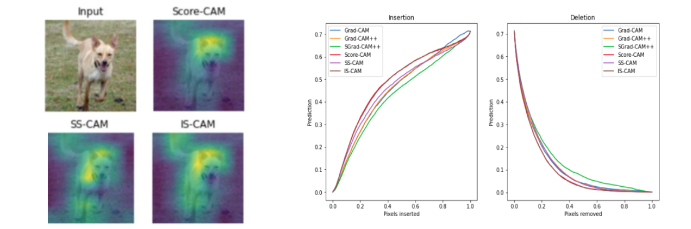

---

##### View

+ [Poster](poster.pdf)
<!-- + [Online appendix](appendix2.pdf) -->
<!-- + [Code and data](https://github.com/pmichaillat/unemployment-gap) -->

---

##### Abstract

Class Activation Mappings (CAMs) highlight the features that contribute to the output of the model. We present two new variants of Score-CAM:- 1. By a smoothing function to generate localised features. 2. Through an Integration function to furnish sharper axiomatic-based attribution maps. We visually demonstrate that our methods significantly assist in interpreting models by providing concentrated heat maps and concrete decision-related features.

---

##### Figure X: Poster



---

##### Citation

Naidu, Rakshit & Kundu, Soumya & R Nayak K, Shamanth & Maurya, Yash. (2021). Improved variants of Score-CAM via Smoothing and Integrating. 10.13140/RG.2.2.23611.54563. 

```BibTeX
@unknown{ImprovedCAM,
author = {Naidu, Rakshit and Kundu, Soumya and R Nayak K, Shamanth and Maurya, Yash},
year = {2021},
month = {06},
pages = {},
title = {Improved variants of Score-CAM via Smoothing and Integrating},
doi = {10.13140/RG.2.2.23611.54563}
}
```

---

<!-- ##### Related material

+ [Presentation slides](presentation2.pdf) -->

